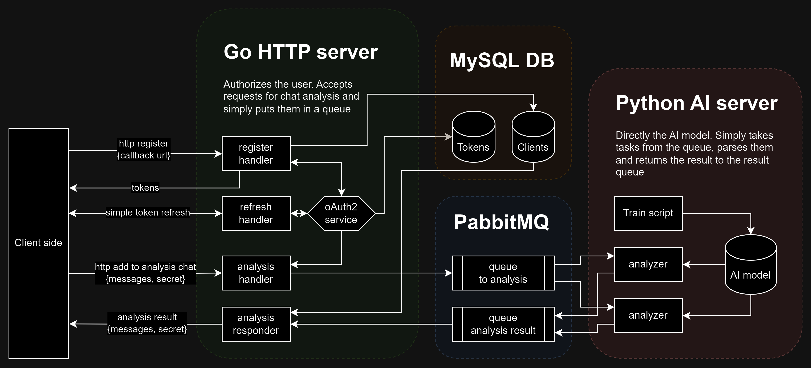

# Emotional Analyzer

Небольшой проект для хакатона и ознакомления с AI.\
Сервис предназначен для определения эмоции по тексту.

Для поднятия сервиса:
```shell
make all
```

Для тестирования подготовлены http запросы в [tests/http](tests/http).

А так же предоставлен рабочий пример бота для телеграм в [tests/telegram-bot](tests/telegram-bot) 
```shell
echo "BOT_TOKEN=telegram_token" > tests/telegram/.env # Put your telegram token
```
```shell
make tests_telegram_bot
```

## How use this

### [POST /register](tests/http/register.http)

Эндпоинт авторизации, необходимо сообщить сервису ссылку, на которую будет возвращаться результат.\
В ответ сразу будет возвращена пара токенов, готовых к работе.

```json
{
  "callback_url": "https://example.com/"
}
```
```json
{
  "access_token": "XXXX",
  "expires_in": 7200,
  "refresh_token": "XXXX",
  "token_type": "Bearer"
}
```

### [POST /oauth/token](tests/http/token_refresh.http)

Жизнь access токена ограничена двумя часами, жизнь refresh токена ограничена двумя днями: [cmd/factory/http.go](cmd/factory/http.go#L44-L48).\
Для получения новой пары токенов необходимо отправить актуальный refresh токен и получить в ответ новую пару токенов.

```json
{
  "grant_type": "refresh_token",
  "refresh_token": "XXXX"
}
```
```json
{
  "access_token": "XXXX",
  "expires_in": 7200,
  "refresh_token": "XXXX",
  "token_type": "Bearer"
}
```

### [POST /analyze/task](tests/http/addToAnalysis.http)

Основной эндпоинт, предназначенный непосредственно для постановки задачи сервису.

Требует заголовок Authorization\
Требует поле `messages`, в которое необходимо поместить ассоциативный массив, в качестве ключа и значения должны быть строки.\

Так же есть возможность указать опциональное поле `secret`, содержащую строку,
которое будет проброшено сквозь всю цепочку и возвращено в ответе.

Например, это поле можно использовать для авторизации запроса от сервиса или для идентификации задачи.\
В демонстративном телеграм боте реализованы обе эти возможности: [tests/telegram-bot/api.go](tests/telegram-bot/api.go#L38-59)

В случае успеха, код ответа будет - 201.

```json
{
  "messages": {
    "1": "How are you?",
    "2": "Im fine!"
  },
  "secret": "secret"
}
```

### Result hook

Сервис возвращает результат по http на ссылку, указанную при регистрации.

В теле ответа будет поле `messages`, в котором будет ассоциативный массив.\
В качестве ключа будет идентификатор, переданный ранее при постановке задачи.\
В качестве значение будет эмоция в виде строки. Всего таких эмоций 12:
```json
["anger", "boredom", "enthusiasm", "fun", "happiness", "hate", "love", "neutral", "relief", "sadness", "surprise", "worry"]
```

Так же в теле будет возвращено поле `secret`, переданное ранее при постановке задачи.

```json
{
  "messages": {
    "1": "surprise",
    "2": "happiness"
  },
  "secret": "secret"
}
```

## How it's work

Сервис состоит из 2 основных частей: Go HTTP и Python AI 



### Go HTTP server

Обыкновенный web сервер, реализующий авторизацию и API.

Сервер авторизовывает клиентов по токену, у клиентов прописан `callback_url`.

Принимает, формирует задачу для AI и отправляет в брокера очередей, в данном случае RabbitMQ.\
Код брокера вынесен в абстракцию в pkg и подразумевает легкую замену под любой другой брокер очередей.

Параллельно запущен воркер, который слушает очередь брокера очередей и берёт от туда результаты AI.\
Результаты будут отправлены по http на `callback_url` пользователя.\

Кол-во параллельно запущенных воркеров конфигурируется: [internal/config/config.go](internal/config/config.go#L46)

Для отправки результатов по http авторизация предусмотрена в виде поля `secret`,\
который передает клиент при постановке задачи.

Токены и клиенты хранятся в базе данных, в данном случае MySQL. Миграция автоматическая.

### RabbitMQ

Брокер очередей выступает связывающим звеном между двумя серверами.

В качестве брокера очередей для данного сервиса подойдёт любой, поскольку не используются специфичные возможности.

Выбран был в первую очередь, потому что автору было интересно потыкать его,
а во вторую очередь - имело идентичные зеркальные библиотеки на Go и Python, что является удобным в данном контексте.

### Python AI server

Вся Python сторона расположена в директории ai, за исключением [config/.env](config/.env) и [docker/python.Dockerfile](docker/python.Dockerfile).

Используемая модель: keras tensorflow\
Датасет по умолчанию: https://www.kaggle.com/datasets/pashupatigupta/emotion-detection-from-text

Датасет по умолчанию содержит лишь выражения на английском языке, однако модель вполне возможно обучить и на русском.

Небольшой сервис, состоящий из двух скриптов:
1. `learn.py` - запускается при старте сервиса, проверяет валидность модели и может начать обучение модели
2. `work.py` - запускается с помощью `supervisor`, берет готовую модель и запускает воркер.

